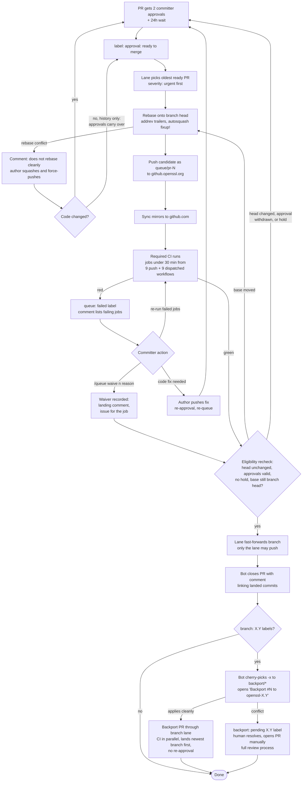
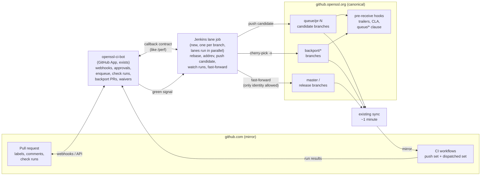

# Merge queue for openssl/openssl

Proposal and plan. Numbers are from `openssl/openssl`, 2026-08-20 to 2026-09-20.

## Summary

Today a committer rebases or cherry-picks a PR on their own machine and pushes it. No CI
result exists for that exact commit. PR CI tested a different one, the PR merged with
master through GitHub's merge ref at the time of the run. A committer may build locally,
but nothing requires or records it. Pre-receive hooks check trailers and CLA. Nothing
checks a CI result for the commit that lands.

The fix: a bot does the rebase, CI runs on the result, and the branch moves only if CI is
green. That is a merge queue. The main gains are less manual work for maintainers and a
guarantee about what lands. It does not fix flaky tests; a flake becomes a red candidate
instead of a red master. Known flakes are quarantined or fixed first, and a committer can
waive a flaky job on a candidate, on the record (see Failed candidates).

OpenSSL already has a second CI step. At two committer approvals the bot runs eleven
heavy workflows on the PR head. The queue runs the same workflows on the rebased commit
and makes the result binding, except the jobs that take longer than 30 minutes. Those
keep running after the merge, as today. It replaces that step, it does not add one.

Backports become PRs against the release branch, opened by the bot and landed by the same
queue.

The first step is shadow mode: the queue runs but lands nothing.

## Problems today

| Problem | Evidence |
|---|---|
| The landed commit was never built by CI | PR CI tested a merge with master at run time. The rebase, any conflict fix, and PRs landed in between are untested. A local build is optional and leaves no record |
| Master goes red and is fixed forward | 9 of the last 60 main-CI runs on master were red; 20 PRs labelled `severity: urgent` in 90 days. Most reds are flakes |
| Merging depends on a few people | one committer did 99 of the last 200 merges. Merging needs a checkout, a canonical push key and a build machine |
| Backports get thin coverage and no review on their branch | openssl-3.6, last 60 days: ~130 direct cherry-picks vs ~40 PRs. `backport.yml` builds and tests on one Linux configuration; nobody reviews the change against the branch |
| Backport provenance is patchy | `ghmerge --cherry-pick` picks from the PR branch, so it cannot add a `cherry picked from` line. About a third of stable-branch commits lack one |

## How the queue works

1. A PR gets `approval: ready to merge`. Same rules as today. That label is now the
   committer's whole act; whether they merge with `ghmerge` or by hand today makes no
   difference. A PR is queued only against its own target branch. There is one lane per
   branch, and lanes run in parallel. `branch: X.Y` labels do not make the queue merge
   elsewhere; they make the bot open backport PRs after the master PR lands (see
   Backports). Feature branches have no lane; merging one into master is a PR to master
   like any other.
2. The lane takes the oldest ready PR for that branch (`severity: urgent` first),
   rebases it onto the branch head, runs `addrev` on its commits, and pushes the result
   as `queue/pr-N` to `github.openssl.org`. The sync mirrors it to github.com within a
   minute and the push workflows run there; the bot dispatches the rest of the required
   set against it.
3. Green: the lane checks the PR is still eligible (head unchanged, approvals valid, no
   hold, branch head still the one the candidate was built on) and fast-forwards the
   branch to the candidate. Only the lane's identity may push to master, so nothing else
   can land a commit (see Architecture). The bot closes the PR with a comment linking
   the landed commits, as the merging committer does today. Every landing is visible on
   the PR as a check run and that comment.
4. Red: the bot adds `queue: failed`, comments with the failing jobs, and moves on to the
   next PR, so one red PR does not hold up the others. Master never receives the red
   commit. A committer re-runs the failed jobs or waives a flaky one; the label clears and
   the PR re-enters at its place in the queue (see Failed candidates). If the code needs a
   fix, the author pushes it and the usual re-approval follows. A PR that does not rebase
   cleanly is reported the same way before anything runs.
5. Once a branch only moves to tested commits, its push CI is redundant for tests.

### Failed candidates

Everything happens on the PR. The candidate is a branch, not a PR, so there is nothing
else to look at or to type into. When a candidate fails, the bot comments with the failed
jobs, numbered and linked:

```
Candidate failed. Jobs:
  1. GitHub CI / no-shared-macos
  2. Windows GitHub CI / VC-WIN64A
Re-run from the links above, or /queue waive [n] <reason>.
```

- **Retry.** The candidate branch has ordinary workflow runs, so "Re-run failed jobs" on
  the Actions page is the retry. The lane takes the latest attempt as the result.
- **Waive.** `/queue waive 1 qlog flake, see #12345` lands the PR despite that job being
  red. `/queue waive <reason>` waives everything in the list. The bot refuses when a
  configure or build step failed rather than a test, or when more than three jobs failed;
  that is not a flake. A reason is required. The waiver is valid until the PR head
  changes, so it survives a rebuild after master moves. It is recorded in the landing
  comment and in an issue for the job.
- **Anything else** is a PR revision, as today, followed by re-approval and the ready
  label.

### Required candidate tests

The queue needs a fixed list of jobs that count. It starts from the nine workflows that
run on a push today plus the eleven the bot dispatches at two approvals. Two are in both
lists, so eighteen files:

- push set: `ci.yml`, `windows.yml`, `windows_comp.yml`, `run-checker-merge.yml`,
  `run-checker-ci.yml`, `cross-compiles.yml`, `compiler-zoo.yml`, `fuzz-checker.yml`,
  `perl-minimal-checker.yml`
- dispatched set: `ct-validation-daily.yml`, `run-checker-daily.yml`,
  `valgrind-daily.yml`, `avx512-sde.yml`, `os-zoo.yml`,
  `aarch64-more-cross-compiles.yml`, `riscv-more-cross-compiles.yml`, `oss-fuzz.yml`,
  `interop-tests.yml`, plus `compiler-zoo.yml` and `run-checker-merge.yml` again

From those, jobs that normally take longer than 30 minutes are not in the gate. They keep
running after the merge, on master push or in the nightlies, as they do today. Measured
from May to September 2026 that is twelve jobs: valgrind, oss-fuzz, the gnutls interop
test, os-zoo on `linux-riscv64` and `windows-arm64`, MSan for SLH-DSA, VS2013 x86, and
the hppa, m68k, sh4, armel and mipsel cross-compiles. Capacity explains why the cut is at
30 minutes.

Only the first list starts on a push. The other nine run on schedule or dispatch only,
so the bot dispatches them against the candidate commit, the same way it dispatches them
against a PR head today. Dispatch inputs matter: the RISC-V workflow runs its tests only
on a push or when the PR input is set, so the bot passes the PR and the candidate SHA.
The bot waits until the candidate commit is visible on github.com before dispatching; the
sync is a poll, not a guaranteed delivery time.

A green workflow file is not the pass condition. The bot keeps an expected list of jobs
per workflow and compares it with the jobs that actually ran. Its existing check for
AArch64 and RISC-V runs that built without testing is the model. A required job that did
not start, was skipped, or was cancelled fails the candidate.

Five push workflows ignore documentation-only changes. A candidate that touches only
those paths therefore expects only the documentation workflows, and the bot derives the
expected set from the candidate's diff. In phase 3 the push workflows gain the dispatch
inputs, the bot dispatches every required workflow explicitly, and path filters stop
mattering. Nightly and performance jobs are not part of the gate.

### Capacity

A candidate takes as long as its slowest job, plus runner wait (median under a minute,
p90 about 14 minutes). A typical day lands 11 PRs and a busy day 20, most inside a
seven-hour window; the lane works around the clock.

| | Full list | 30-minute cut |
|---|---|---|
| Slowest job | valgrind, about 78 min | about 30 min |
| Typical day | lane busy about 15 h, waits up to about 8 h | lane busy about 6 h, waits up to about 2 h |
| Busy day | about 27 h of work, backlog carries into the next day | 10 to 15 h, drains the same day, waits up to about 5 h |

What the cut costs, from master CI between 2026-05-01 and 2026-09-23 (1478 commits):
most breakages on the long jobs happened on commits where fast jobs failed too, usually
a broken test, so the gate would have stopped them anyway. Six were visible only on long
jobs:

| Found only by | What happened | Kind |
|---|---|---|
| valgrind | 19 nights in July: uninitialised bytes passed to `write()` in the TLS client flush path | real bug |
| oss-fuzz | a week in July: a new ECH fuzzer without a seed corpus broke the OSS-Fuzz build | integration break |
| valgrind | since Sep 22: `dtls_multithread_test` fails, cause open | unknown |
| hppa | 4 days in August: toolchain relocation limit, fixed in the workflow | CI environment |
| interop | 3 days in September: the container changed the `tmt` command line | CI environment |
| VS2013 | September: toolchain image pull failed | CI infrastructure |

So the cut lets about one real bug and one integration break through in five months,
still caught after the merge by the same jobs as today. In return the three environment
breakages would not have stopped all merging, the hppa one for four days. Why 30 minutes:
the Windows jobs take 25 to 27 minutes, and a lower cut would drop them. On Sep 18 they
were the only jobs that caught a real regression, when an ASN1_STRING change broke the
Windows FIPS build.

If latency is still not acceptable, batching is in the appendix. Shadow mode replays the
real ready-label times through a serial lane; suggested bound before landing starts: 95
percent of PRs land within 12 hours of ready.

## Shadow mode

The queue runs but lands nothing. Committers keep merging exactly as today. Master push CI
stays.

- Two committer approvals make the lane build `queue/pr-N`, rebased onto the current
  master with trailers added. The push set runs on it.
- The bot's existing dispatch of the eleven heavy workflows, which fires at two approvals
  today, is pointed at the candidate commit instead of the PR head. Same cost as now, and
  the result is for the commit that would land. Heavy feedback still arrives at approval
  time, inside the 24-hour wait.
- Shadow runs the full list, long jobs included, so the 30-minute cut is checked against
  fresh data before landing starts.
- The bot posts one advisory check on the PR: pass, fail, or "does not rebase cleanly".
- No landing, no ordering, no ejection, no backport PRs.
- The queue branch is throwaway. It is rebuilt when the PR head changes or master moves
  far enough that the result is stale, and deleted when the PR closes. Nothing from it
  ever lands.
- Per candidate the bot records the PR head, the master commit it was built on, the
  candidate SHA and tree, the runs that counted, and later the commits that actually
  landed for that PR.

It produces: candidate duration and queue delay, first-attempt pass rate of the whole
required set, how often a long job fails when every gate job passed, and how many PRs
were green in the PR but red once rebased. Classify that
last number: real integration failure, a test the PR never ran, or a flake. It also
compares the landed tree with the candidate tree. Equal trees mean the same content
landed. Different trees have several possible causes, base drift, a conflict fix, a
manual edit at merge time, and the recorded fields say which.

Cost: one extra push-set run per approved PR. The heavy set costs what it costs today.

## Architecture

| Component | Role | Why there |
|---|---|---|
| `openssl-ci-bot` (exists) | webhooks, label and approval rules, enqueue decision, check runs, comments, opening backport PRs | already the GitHub App; already counts committer approvals and creates check runs |
| Jenkins lane job (new, one per branch) | rebase, cherry-pick, push candidate, watch runs, fast-forward | already holds the canonical push key; the bot to Jenkins callback contract exists (`/perf`) |
| `queue/*` and `backport/*` branches on `github.openssl.org` (new) | carry candidates and backports; the existing sync mirrors them | no second repository, no sync change |

**Why the main repository and not a mirror.** `windows.yml` downloads dependencies
differently when the repository is not `openssl/openssl`; a mirror would test a path
master never runs. Pushing to the canonical server also means the sync needs no change
and the existing hooks check the candidate's trailers early. Three hooks,
`check-reviews`, `no-fixup-or-squash` and `no-merge-commits`, scan the whole history for
a new branch unless it is named `openssl-*` or `feature/*`. All three need a clause for
`queue/*` and `backport/*` that diffs against the target branch, tested against the real
hook environment for creating, replacing and deleting these refs. The release-freeze
ruleset covers the new namespaces too, since it excludes only `feature/*`: during a
freeze the lane's candidate push is refused, the lane pauses and shows that on the PRs,
and resumes when the freeze is lifted.

**How the gate is enforced.** Branch protection on the canonical server gets a push
restriction: only the lane's identity may push to master and the release branches. This
is the same rule github.com already applies to its mirror, where only `openssl-machine`
may push. The lane pushes only candidates that passed the required set, so "only the lane
pushes" is the whole guarantee. A manual push, with `ghmerge` or by hand, is refused by
the server. Emergency
pushes go through a repository role with `bypass_branch_protection`, as the Releaser role
already does, and show up in the audit log as bypasses. The restriction is switched on at
phase 3, when landing starts; shadow mode changes nothing.

Queue order comes from GitHub: label time, `severity: urgent` first. Per candidate the lane
records PR head, base, candidate SHA and the accepted runs, and survives a Jenkins restart
or a lost callback. No database.

## Backports

Rule: **every change to a release branch is a PR against that branch.**

- When a master PR lands with `branch: X.Y` labels, the bot cherry-picks the landed
  commits with `-x` to `backport/*` and opens `Backport #N to openssl-X.Y`. Same recipe
  as `backport.yml`.
- Trailers. The cherry-pick keeps the author, the master `Reviewed-by` lines and its
  `Merged-from`. Git's `-x` writes a plain `(cherry picked from commit …)` line; the lane
  rewrites it into a `Cherry-picked-from:` trailer, the same way `addrev` already turns
  the old `(Merged from …)` line into `Merged-from:`. At landing the lane runs `addrev`
  with the backport PR and its approvers: `Reviewed-by` is deduplicated, `Merged-from`
  points at the backport PR. `addrev` keeps an existing `Merge-date`, so the lane strips
  master's before running it and the backport gets its own landing date. All of this
  happens before CI runs on the candidate; nothing is rewritten after. Same result as a
  hand-made backport PR today.
- Conflict. The bot cannot resolve it and the master PR cannot be changed, since it is
  already merged. So the bot opens no PR, adds `backport: pending X.Y` to the master PR,
  and comments with the exact `git cherry-pick -x` command and the branch. A human, the
  author or any committer, runs it, resolves the conflict, and opens a normal PR against
  `openssl-X.Y`. That PR goes through the full review process and the branch's lane. The
  bot removes the label when every commit of the master PR has a matching
  `Cherry-picked-from:` on the branch, or when a committer records that only part of it
  is wanted. One matching commit does not clear a multi-commit backport. Open labels are
  listed for the release manager, so a forgotten backport is visible rather than buried
  in a closed PR.
- Backport PRs go through that branch's lane.
- Order. Backports of one master PR land in branch order, newest first: 4.0 before 3.6,
  3.6 before 3.5. Their CI runs in parallel in their own lanes, but a green candidate for
  an older branch waits until the backport to the next newer branch has landed, and is
  rebuilt if its own branch moved in the meantime. If a newer branch's backport fails,
  including on a flake or a CI outage, the older ones wait until it is re-run, waived,
  fixed, or dropped by a committer removing that branch's label.
- Approvals. A bot-opened backport that applied cleanly is a copy of a change two
  committers already approved, landing on a branch where today it lands with no review at
  all. It needs no further approval: once its lane is green it lands, with the master
  approvals recorded in the PR body. A hand-resolved backport is new code and keeps the
  full process. This is a review-policy change and needs agreement.

Expected volume: 100 to 150 backport PRs a month. Without the bot opening them the rule
would not hold.

## Commit history

Today the merging committer tidies the history before pushing, usually inside
`ghmerge`'s interactive rebase: squashing, splitting, rewording. There is no policy for it,
only the contributor-facing rules in CONTRIBUTING (one logical change per PR, titles of 50
to 70 characters, use `fixup!` commits during review, "fixup commits are squashed when the
PR is finally merged"). The queue removes the interactive step, so the tidying needs a
defined place.

How much tidying happens, from the last 60 merged PRs:

| Outcome at merge | PRs |
|---|---|
| Landed exactly as in the PR | 48 |
| Only `fixup!` commits squashed | 7 |
| Plain commits squashed by hand, or one commit split | 3 |
| Same commits, subject reworded | 2 |

The proposal has three parts. The first is mechanics the lane does on its own. The
second is what a committer can do when the history is not right. The third writes down
what committers already do.

What the lane does by itself:

- Runs `git rebase --autosquash` when it builds the candidate, so `fixup!` and `squash!`
  commits fold into their targets. This is what CONTRIBUTING already promises. Autosquash
  reorders commits and can conflict; if it does, the PR is reported as "does not rebase
  cleanly" and the author squashes and force-pushes. A `fixup!` that points outside the
  PR is reported the same way.
- Keeps the commits otherwise. A multi-commit PR lands as it is, as today.

What a committer can do when that is not enough:

- `/squash`, one bot command. It squashes the PR into one commit at candidate build. The
  message is the PR title plus the PR body, with the template's HTML comments and
  checklist removed and `Fixes #` lines kept. Other commit authors become
  `Co-authored-by` trailers. Any committer can edit a PR title and body in the GitHub
  UI, so this is how a committer writes the landing message without pushing to the
  contributor's fork. The lane snapshots title and body when it builds the candidate; an
  edit after that invalidates the candidate, and the message is never regenerated after
  CI has run.
- Anything else, meaning reword, split, or squashing only some commits, is a normal PR
  revision: push to the PR branch (allowed by default on fork PRs) or ask the
  contributor. It happens before the ready label, in the open. At today's rate this is
  about one PR a day.

Existing practice to write down:

- A push that changes only commit messages or history, not the code, does not cost the
  PR its approvals or its place in the 24-hour wait.

  What happens today when a committer pushes such a cleanup, checked in the code:
  GitHub keeps the approvals, since it only drops them when the diff changes. The label
  bot that turns `approval: done` into `approval: ready to merge` after 24 hours sees a
  new commit as activity and, instead of moving the label, asks a human to do it. The
  CI bot only counts an approval if it was given on the current head, so a new head
  means the heavy CI is not dispatched again until someone re-approves.

  The rule: the bot compares the diff of the new head against master with the diff of
  the approved head. If they are the same, the approvals count for the new head, and the
  label bot moves the label as if nothing had happened. A withdrawn approval, a review
  requesting changes (including to the commit messages), or a hold label is never carried
  over. CI results are never carried over either: a new head is a new candidate and is
  tested again.

  Today the merging committer edits messages after approval and nobody re-approves. This
  writes that down and lets the bot check it.


## CI usage

Job-minutes across runners. Runners are free for public repos; org concurrency is the
limit.

| Today, per month | Job-min |
|---|---|
| Pull-request runs (1447 main-CI runs; 340 PRs merged) | 1.04 M |
| Push runs, master and release branches (454) | 0.56 M |
| Dispatch at two approvals (~228 sets of ~1225) | 0.28 M |
| Nightlies (429 runs) | 0.04 M |
| **Total** | **≈1.9 M** |

A candidate with the 30-minute cut is about 1670 job-minutes: the push set (~1240) plus
the heavy set (~1225), minus the two workflows in both, minus about 500 job-minutes of
long jobs. 340 candidates a month is 0.57 M. The long jobs keep running after the merge:
the long cross-compile and VS2013 legs on master push (about 0.04 M a month), the rest in
the nightlies, as today.

| Scenario | Added | Removed | Net per month |
|---|---|---|---|
| Shadow: push set on the candidate; heavy set redirected from PR head to candidate | +0.42 M | — | +0.42 M, +22 % |
| Landing, serial, 30-minute cut | +0.57 M | master push tests except the long legs −0.17 M, approval-time dispatch −0.28 M | +0.12 M, +6 % |
| … plus retries at a 5 % per-candidate failure rate | +0.03 M | | +0.15 M, +8 % |
| Batches of 2 to 4, if ever adopted | | | −0.17 to −0.31 M |

The "removed" column is only removed at phase 4, when master push CI is switched off for
tests; until then the landing rows are 0.17 M higher. The candidate built at two approvals
in shadow is not kept in landing: master moves about eleven times a day, so a candidate
built 24 hours earlier is almost never still on the branch head, and testing at both
moments would pay twice. Heavy feedback therefore moves from approval time to ready time.
Committer feedback on the first draft favoured exactly that: one heavy run, at landing.

Serial landing costs about 6 percent more CI than today, 15 percent until master push
tests are dropped in phase 4. That is the price of the simple design; savings only
appear with batching. Preliminary: backport PRs and release
lanes are not included. Justify the pilot on maintainer work and assurance, not on
savings.

### `/ci` and the nightlies

The automatic dispatch at two approvals is what the queue replaces. In shadow it is
redirected at the candidate. In landing it stops, and the heavy set runs on the candidate
built at ready. Heavy feedback therefore arrives about a day later than today.

Manual `/ci` stays as it is: it runs a workflow against the PR head. There is no separate
command for the candidate. A failed candidate job is re-run from the Actions page, and
the only new command is `/queue waive` (see Failed candidates).

Nightlies stay. They are two percent of the load, carry most of the long jobs that left
the gate, and cover what a gate cannot. CT logs,
interop peers and the fuzz corpus change on their own. Valgrind and fuzzing are
probabilistic. Runner images drift. They are also the reference when classifying a
candidate failure. Deterministic gate workflows could go weekly; small saving, not
urgent.

### Dropping push CI

Only on a branch with a lane, and only after landing has run for a while. The check is
that the candidate's recorded base still equals the branch head (not its parent, because
of multi-commit PRs). Emergency pushes bypass the queue, so push CI stays as their
fallback: skip a push run only when candidate evidence exists for that exact commit.
Keep `deploy-docs-openssl-org.yml`, it is a side effect, and keep the long legs of
`cross-compiles.yml` and `compiler-zoo.yml`, since they left the gate. Release branches
are 283 of the
454 push runs, so the larger saving comes later with their lanes.

Optional later: two-step CI. That means running only the fast workflows on every PR
push, and the heavy ones (`windows.yml`, `cross-compiles.yml`, `run-checker-ci.yml`)
only on the candidate, once per PR instead of on every revision. Saves about 0.6 M a
month. Contributors would no longer see those results on their PR until it is ready, so
it is a separate committer decision.

## Policy changes

The infra team owns the machinery. Committers own the workflow rules. No review rule
changes: clean backports landing without re-approval and approvals carrying over
message-only changes are both existing practice that is not written down yet. Once the
proposal is accepted, they go into PRs to `general-policies` and `technical-policies`.

- Committer policy: the bot pushes; the committer's act is the label.
- A committer may waive a named flaky job on a red candidate, with a reason, on the
  record. No waiver for a failed build.
- Clean bot backports land once their lane is green, with no re-approval.
- History is final before ready, as in "Commit history" above: `fixup!` commits are
  autosquashed by the lane, `/squash` is available, anything else is a PR revision.
- Approvals and the 24-hour clock carry forward when a push changes only commit messages
  or history and not the code.
- Release branches only via PR.
- Emergency path: `ghmerge` and direct push through a bypass role, push CI as fallback.

## Plan

| Phase | Scope | Exit |
|---|---|---|
| 0. Prerequisites | fix the required set, the 30-minute cut and the expected jobs per workflow; quarantine or fix the known flaky jobs (qlog on macOS, FreeBSD); announce | no required job fails on master more than once a week |
| 1. Shadow, 4 to 6 weeks | clause in three hooks; master lane building at two approvals; full list including long jobs; heavy dispatch redirected to the candidate; advisory check; `ghmerge` unchanged | classified red-candidate counts, long-job-only failures, tree-match rate, candidate duration, replayed serial-lane wait distribution |
| 2. Auto backport PRs | bot opens them on landing; pending labels; manual picks still allowed | committers prefer the generated PRs |
| 3. Landing on master | serial lane; 30-minute cut in force; dispatch inputs added to the push workflows; autosquash and `/squash`; approval carry-over; `/queue waive`; eligibility recheck; push restriction on master; push CI still on | 4 weeks of landings; wait bound held; waivers per week trending down |
| 4. Drop duplicate CI | skip master push tests where candidate evidence exists | emergency and release pushes still covered |
| 5. Release-branch lanes | one lane per branch; manual cherry-picks banned | all release-branch commits arrive via PR |
| 6. Optional | two-step CI (heavy workflows only on candidates) | committer decision |

Phase 1 touches the repository only through the `queue/*` branches and the hook clause.
No workflow edits, no protection changes.

## Risks

- Flakes become red candidates. Retry and waive exist for that, and pausing the lane in
  an outage instead of failing every PR. The risk is the other way round: waivers become
  routine and the required set stops meaning anything. Hence the waiver count is public
  and a phase 3 exit criterion.
- Several busy days in a row can build a backlog a serial lane does not clear. The wait
  bound and the replay in shadow are there to catch this before landing starts.
- A required workflow that silently skips would let an untested candidate land. Missing
  or cancelled counts as failure.
- Candidates share runner concurrency with PR CI; latency at peak.
- A failed candidate must be distinguishable from a broken branch. Extend the Actions
  statistics collector to link candidate, PR and landed commit; keep its run-name
  contract with the bot.
- The queue is a service that can stop all merging. The infra team owns that.
- Contributors do more cleanup. Tidy history is fair; repeated rebasing onto a moving
  master is not, the bot exists for that.

## Appendix: diagrams

Contributed by Richard Levitte, adjusted to the current text.

### Process flow



### Components



## Appendix: batching, if latency requires it

Not part of the proposal. Kept so the design does not have to be rediscovered.

The lane takes up to four ready PRs, rebases them in order onto the branch head, runs
`addrev` on each, and tests one candidate. Green lands all of them. Red splits the batch
in order: the first half is tested on the current head and lands if green; the rest is
rebuilt on the new head and tested again, until the failing PR is alone and ejected.
Two PRs can each pass alone and fail together; if every member passes alone, they land
one at a time and the one that fails on top of the others is ejected naming the conflict.
Every landing is a fresh pass on the current head. A PR gets two rebuilds, then it is
ejected. A batch starts at four waiting PRs, or when the oldest has waited fifteen
minutes, or when the lane is idle; urgent PRs go alone. Flakes cost more here, because a
red batch means a bisection; more than about one a day means batches are too large or
tests too flaky. Batches would be exercised in shadow without landing before being
trusted.

## References

- rust-lang/bors, the implementation this design follows:
  https://github.com/rust-lang/bors
- The existing `/ci` command:
  https://github.com/openssl/openssl/wiki/Triggering-CI-on-a-pull-request
